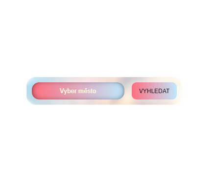
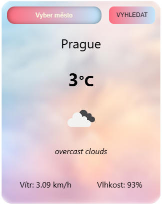

# Weather App (React)

Weather App is a simple web application that allows users to search for current weather information by city name.  
The application fetches real-time data from a public weather API and displays essential weather details in a clean and user-friendly interface.

This project was created as a learning and portfolio project to demonstrate practical React and API integration skills.

---

## Features

### DONE

- Search weather by city name
- Fetch real-time data from OpenWeather API
- Display current temperature in Celsius
- Show weather description and icon
- Display wind speed and humidity
- Input validation (empty input, city not found)
- Search using Enter key or button click
- Responsive layout
- Environment variable usage for API key

### TODO / Possible Extensions

- 5-day weather forecast
- Loading and error states
- Geolocation support
- Temperature unit switch (°C / °F)
- Improved UI animations
- Saving searched cities

---

## Technologies, Frameworks and Tools

- JavaScript (ES6+)
- React
- HTML5
- CSS3
- Fetch API
- OpenWeather API
- Vite
- Environment variables (.env)

---

## What This Project Demonstrates

- Working with React functional components
- State management using `useState` and `useEffect`
- Controlled form inputs
- Conditional rendering
- Handling asynchronous API requests
- Basic error handling
- Using environment variables in a frontend project
- Integration with third-party REST APIs

---

## Screenshots





Live Demo: [https://weather-app-react-api-three.vercel.app/](https://weather-app-react-api-three.vercel.app/)


---

## How to Run Locally

```bash
git clone https://github.com/your-username/weather-app-react.git
cd weather-app-react
npm install
npm run dev
```
